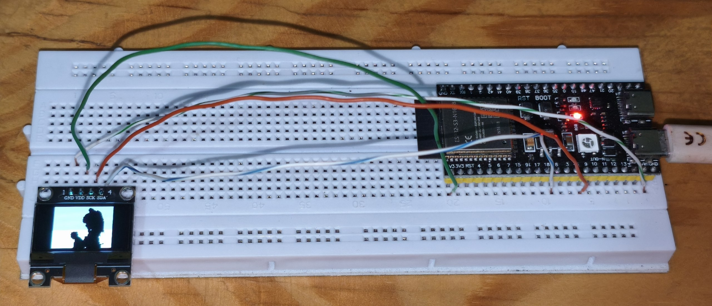

# ESP32-S3 Bad Apple OLED

Reproduce **Bad Apple** (o cualquier video) en un panel OLED **SSD1306 de
0.96" (128x64)** usando un **ESP32-S3**.

El video completo se guarda como archivo binario en la **partición de datos
(LittleFS)** de la placa. Por eso cabe a **resolución completa** y con la
duración completa, sin recortar frames ni comprimirlos dentro del firmware.

---

## Vista del montaje (IRL)

Pon aquí una foto real del proyecto (ESP32-S3 + OLED reproduciendo):



> Puedes reemplazar `galeria/image.png` con tus propias fotos o agregar más
> imágenes en esa carpeta y actualizar la ruta.

---

## Características

- **Video completo en LittleFS**: el firmware solo lee `badapple.bin` desde la
  partición de datos; no se compilan los frames dentro de la app.
- **Binarización ajustable**: variable `BW_THRESHOLD` en `convert_oled.py` para
  controlar el límite blanco/negro de cada pixel.
- **Aspecto de video respetado**: cada frame se encaja dentro de 128x64
  conservando la relación de aspecto, centrado y con bordes negros (ni recorta
  ni deforma).
- **Dos modos de resolución**: `FULL_RES = True` (resolución completa) o
  `FULL_RES = False` (pixeles dibujados como bloques).
- **Reproducción por reloj**: el firmware usa `millis()`, así que si el panel
  va lento **salta frames** en vez de atrasarse la reproducción.
- **Un solo reset al final**: `main.py` sube filesystem + app con un único
  reinicio de la placa al terminar.

---

## Requisitos

### Hardware

| Componente | Detalle |
|---|---|
| Microcontrolador | **ESP32-S3** (proyecto configurado para la placa `4d_systems_esp32s3_gen4_r8n16`, 16 MB de flash) |
| Pantalla | **OLED SSD1306 128x64** con interfaz **I2C** |
| Otros | Cables dupont, cable USB |

### Software

- **Python 3.8+** con el paquete **`pygame`**.
  ```bash
  pip install pygame
  ```
- **[PlatformIO](https://platformio.org/)** (CLI `pio` o la extensión para VS Code).
- **ffmpeg**: necesario para extraer los frames del video en `pngs/` (el repo no
  los incluye, ver [Puesta en marcha](#puesta-en-marcha-rápida)). También sirve
  para importar tus propios videos.
- [Opcional] Git, para clonar/push del repositorio.

> El script `main.py` utiliza el `esptool` que viene incluido dentro de la
> instalación de PlatformIO (`~/.platformio/...`). En Windows el instalador de
> VS Code/PlatformIO lo deja en `C:\Users\<tu-usuario>\.platformio`.

---

## Conexión (wiring)

| OLED SSD1306 | ESP32-S3 |
|---|---|
| SDA | **GPIO 8** |
| SCL | **GPIO 9** |
| VCC | 3.3V |
| GND | GND |

Dirección I2C: **0x3C** (la más habitual en los módulos SSD1306).

> Los pines y la dirección se pueden cambiar en el C++ generado
> (`SDA_PIN`, `SCL_PIN`, `OLED_ADDR` en el template de `main.py`).

---

## Puesta en marcha rápida

### 1. Obtén los frames del video en `pngs/`

La carpeta `pngs/` **no se sube a GitHub** (pesa ~150 MB y excede el límite de
100 MB de GitHub). Tienes dos opciones:

- **Opción A (recomendada): extrae los frames tú mismo** con ffmpeg. Sigue la
  sección [Importar otro video](#importar-otro-video-tutorial-completo).
- **Opción B:** descarga los frames de Bad Apple desde cualquier fuente y
  colócalos en `pngs/` nombrados `png (1).png`, `png (2).png`, ... (se ordenan
  numéricamente).

### 2. Conecta la placa y ejecuta

Conecta el ESP32-S3 por USB y, desde la raíz del proyecto:

```bash
python main.py
```

Eso hace todo el trabajo en orden:

1. Convierte `pngs/` → `data/badapple.bin` (binario 1 bit por pixel).
2. Genera `src/main.cpp` con los parámetros reales del video.
3. Compila y sube la partición **LittleFS** (el archivo del video).
4. Compila y sube la **app**.
5. **Un solo reset** de la placa → la app arranca y el video se reproduce.

### Opciones del script

| Comando | Qué hace |
|---|---|
| `python main.py` | Convertir + subir filesystem + subir app |
| `python main.py --no-fs` | Convertir + compilar + subir **solo la app** (el FS ya está en la placa) |
| `python main.py --no-upload` | Convertir + compilar, sin subir nada |
| `pio device monitor -b 115200` | Ver el log de arranque (debe decir `LittleFS OK ...`) |

---

## Importar otro video (tutorial completo)

El proyecto sirve para reproducir **cualquier video**, no solo Bad Apple.

### Paso 1: instala ffmpeg

- **Windows:** descarga un build de ffmpeg y agrega la carpeta `bin` al PATH.
- **Linux/macOS:** `sudo apt install ffmpeg` / `brew install ffmpeg`.

### Paso 2: borra los frames anteriores

```bash
# Windows (PowerShell)
Remove-Item pngs\*.png

# Linux/macOS
rm pngs/*.png
```

### Paso 3: extrae los frames de tu video

```bash
ffmpeg -i video.mp4 -vf "fps=30" "pngs/png (%d).png"
```

**Importante:** la FPS de extracción debe coincidir con la variable `FPS` de
`convert_oled.py` (por defecto `30`). Si tu video es corto o pesado, puedes
usar un valor menor (por ejemplo `fps=15`) y ajustar `FPS = 15` en el script.

> `ffmpeg` genera `png (1).png`, `png (2).png`, ... el script los ordena por
> número, no por nombre alfabético.

### Paso 4: ajusta la conversión (opcional)

Edita `convert_oled.py`:

- **`FPS`**: velocidad de reproducción (debe ir a la par con la extracción).
- **`BW_THRESHOLD`**: umbral de binarización blanco/negro. Ver la sección
  [Ajustar el umbral](#ajustar-el-umbral-blanconegro-en-convert_oledpy).
- **`FULL_RES`**: `True` = resolución completa (1 pixel = 1 bloque),
  `False` = bloques `BK x BK` (menor resolución, menos bytes por frame).

### Paso 5: convierte y sube

```bash
python main.py
```

### ¿Qué pasa si el video no "cabe"?

Cada frame ocupa `FB = ((W+7)/8) * H` bytes y la partición de datos es de
**~12.4 MB** (`FS_CAP = 0xBE0000`). Si tu video tiene demasiados frames, el
script usa los primeros que quepan y muestra un aviso:

```
AVISO: N frames no caben en la particion (...); se usan los primeros M.
```

Para que quepan más: baja el FPS de extracción/reproducción, o recorta el video.

---

## Ajustar el umbral blanco/negro (en `convert_oled.py`)

La conversión binariza cada pixel comparándolo contra `BW_THRESHOLD`:

```python
BW_THRESHOLD = 127   # valor 0-255
```

- Un pixel es **blanco** si sus canales R, G y B son **todos mayores** que el
  umbral; si no, es **negro**.
- **Sube** el valor (p. ej. `200`) → solo los blancos puros quedan blancos
  (menos ruido, más área negra).
- **Baja** el valor (p. ej. `80`) → más detalles claros se consideran blancos.

Ejemplos para videos con mucho gris o iluminación baja:

```python
BW_THRESHOLD = 150   # más negro, elimina grises suaves
BW_THRESHOLD = 100   # más blanco, conserva sombras claras
```

Después de cambiar el valor, vuelve a ejecutar `python main.py`.

---

## Cómo funciona

### Conversión (`convert_oled.py`)

1. Cada frame se **redimensiona** para caber en 128x64 **sin deformarse**
   (`fit_in`) y se centra con bordes negros.
2. Cada pixel se **binariza** con `BW_THRESHOLD` y se empaqueta a **1 bit**
   (MSB = pixel más a la izquierda; `1` = blanco).
3. Frames consecutivos se escriben en `data/badapple.bin`: el frame `i` ocupa el
   rango `[i * FB, (i + 1) * FB)` de `FB` bytes.

### Reproducción (`src/main.cpp`, generado por `main.py`)

- El firmware monta **LittleFS** y abre `/badapple.bin`.
- En cada vuelta de `loop()` calcula el frame según **`millis()`**:
  ```cpp
  t = millis() % (NF * FRAME_MS);   // vuelve a girar cuando termina el video
  i = t / FRAME_MS;                 // índice del frame actual
  ```
- Lee el frame del archivo, dibuja cada bit como un bloque `BK x BK` y hace
  `display.display()`.
- Como el reloj es global, si un frame tarda demasiado **se salta**, en vez de
  que el video se atrase.

---

## Estructura del repositorio

```
├── convert_oled.py          # convierte pngs/ -> data/badapple.bin (1bpp)
├── main.py                  # orquesta: convertir + generar firmware + subir
├── src/
│   └── main.cpp             # GENERADO por main.py (no editar a mano)
├── platformio.ini           # configuracion del entorno PlatformIO
├── partitions_custom.csv    # tabla de particiones (app 4 MB + datos ~12.4 MB)
├── pngs/                    # frames del video (NO subidos a GitHub, ~150 MB)
└── data/
    └── badapple.bin         # generado por convert_oled.py (ignorado por git)
```

---

## Configuración de referencia

### `convert_oled.py`

| Constante | Por defecto | Descripción |
|---|---|---|
| `FPS` | `30` | FPS del video (coincide con la extracción de frames) |
| `SCR_W`, `SCR_H` | `128`, `64` | Resolución del panel OLED |
| `FS_CAP` | `0xBE0000` | Tamaño de la partición de datos (~12.4 MB) |
| `FULL_RES` | `True` | `True` = resolución completa, `False` = bloques |
| `BW_THRESHOLD` | `127` | Umbral de binarización blanco/negro (0-255) |

### Firmware generado (`src/main.cpp`)

| Define | Por defecto | Descripción |
|---|---|---|
| `SDA_PIN` | `8` | GPIO I2C SDA |
| `SCL_PIN` | `9` | GPIO I2C SCL |
| `OLED_ADDR` | `0x3C` | Dirección I2C del SSD1306 |
| `FB_PATH` | `/badapple.bin` | Archivo del video en LittleFS |

### `platformio.ini`

- `board_upload.after_reset = no_reset` → los uploads no reinician la placa;
  `main.py` hace el **único reset** al final.
- `board_build.filesystem = littlefs`, `board_build.partitions = partitions_custom.csv`.

---

## Troubleshooting

| Síntoma | Causa probable / solución |
|---|---|
| `OLED SSD1306 no encontrado` | Cableado (SDA=8, SCL=9) o dirección I2C incorrecta. Revisa alimentación y enable. |
| `ERROR: falta /badapple.bin` | La partición LittleFS no se subió. Corre `python main.py` completo (sin `--no-fs`). |
| `AVISO: N frames no caben...` | El video es muy largo para la partición. Baja FPS o recorta el video. |
| `No encuentro pio ...` | PlatformIO no está instalado en el PATH ni en `~/.platformio/penv/Scripts`. |
| La placa no se detecta | El puerto USB no aparece (otro programa lo usa, cable de solo carga, o falta el driver). |
| El video se ve "cuadriculado" | `FULL_RES = False` está activo; pon `FULL_RES = True` en `convert_oled.py`. |

---

## Notas para GitHub

- `pngs/` pesa ~150 MB y **excede el límite de 100 MB de GitHub**, por eso está
  en `.gitignore` y no se sube. Cualquiera que clone el repo debe obtener los
  frames con ffmpeg siguiendo el tutorial de arriba.
- `data/` también se ignora: `badapple.bin` se genera en cada ejecución.

---

## Créditos

- Este proyecto está **basado en** [Bad-Apple-On-Arduino-LCD](https://github.com/SpaceWasTaken/Bad-Apple-On-Arduino-LCD)
  de **SpaceWasTaken**.
- **Bad Apple!!** es una canción del videojuego *Touhou Project* (ZUN / Team
  Shanghai Alice); el video más popular es el *shadow art* de 2008. Este
  proyecto es solo para fines educativos/hobby.
- Reproducción vía Adafruit GFX + SSD1306 sobre PlatformIO/ESP32-S3.